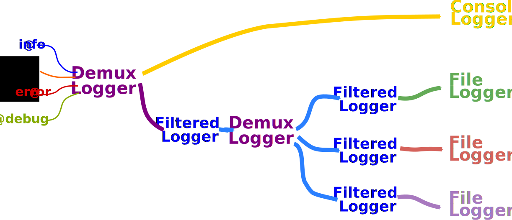

# LoggingExtras

[](https://travis-ci.org/oxinabox/LoggingExtras.jl)

[](http://codecov.io/github/oxinabox/LoggingExtras.jl?branch=master)



# Discussion: Compositional Loggers

LoggingExtras allows routing logged information  to different places when constructing complicated "log plumbing" systems. Built upon the concept of simple parts composed together, subtyping `AbstractLogger` provides a powerful and flexible definition for your logging system without a need to define any custom loggers. When we talk about composability, the composition of any set of Loggers is itself a Logger, and LoggingExtras is a composable logging system.

Loggers break down into four types:
 - *Sinks*: Sinks are the endpoint of a log message journey. They write it to file or display it on the console or set off a red flashing light in the laboratory. A Sink should never decide what to accept, only what to do with it.
 - *Filters*: Filters wrap around other loggers and decide whether or not to pass on a message. When that decision occurs, they can be further broken down (See `ActiveFilteredLogger` vs `EarlyFilteredLogger`).
 - *Transformers*: Transformers modify the content of log messages before passing them on, including metadata, such as severity level. Unlike Filters, they can't block a log message, but they could drop its level down to say Debug so that usually no one would see it.
 - *Tee*: There is only one possible TeeLogger, and it is central to log routing. It acts as a hub that receives one log message and then sends copies to all its child loggers. Like in the diagram above, it can be composed with Filters to control what goes where.

This is a complete taxonomy of all compositional loggers, with this package implementing the entire set. As such, there should be no need to build routing components when configuring the ones included in this package.    

It is worth understanding the idea of logging purity. The loggers defined in this package are all pure. The Filters only filter, the Sinks only sink, and the transformers only Transform.

We can contrast this to the `ConsoleLogger` (the standard logger in the REPL). The `ConsoleLogger` is an impure sink. As well as displaying logs to the user (as a Sink); it uses the log content, in the form of the `max_log`, to decide whether to display a log (Active Filtering); and it has a min_enabled_level setting that controls if it will accept a message at all (Early Filtering, in particular, see `MinLevelLogger`).
If defined in a compositional way, we would write something along the lines of:
```julia
ConsoleLogger(stream, min_level) =
    MinLevelLogger(
        ActiveFilteredLogger(max_log_filter,
            PureSinkConsoleLogger(stream)
        ),
        min_level
    )
```


# Usage
Load the package `using LoggingExtras`.
For convenience, this also re-exports the `Logging` standard library.


### Basics of working with loggers
For full details, see the [Julia documentation on Logging](https://docs.julialang.org/en/v1/stdlib/Logging/index.html)

To use a `logger` in a given scope, do
```julia
with_logger(logger) do
    #things
end
```

To make a logger the global logger, use
```julia
global_logger(logger)
```

To get the current logger (which can vary per task) use
```julia
logger = current_logger()
```

To get the current global logger (which does not vary per task), use
```julia
logger = global_logger()
```


# Loggers introduced by this package:
This package introduces eight new loggers;
the `TeeLogger`, the `TransformerLogger`, and three types of filtered logger, the `FileLogger`,
the `DatetimeRotatingFileLogger` and the `FormatLogger`.
All of them, except `FormatLogger`, just wrap existing loggers.
 - The `TeeLogger` sends the logs to multiple different loggers.
 - The filter loggers control whether to write a message or not.
     - The `MinLevelLogger` only allows messages to pass above a given severity level.
     - The `EarlyFilteredLogger` lets you write filter rules based on the log message's `level`, `module`, `group` and `id`.
     - The `ActiveFilteredLogger` lets you filter based on the full content.
 - The `TransformerLogger` applies a function to modify log messages before passing them on.
 - The `FileLogger` is a simple logger sink that writes to file.
 - The `DatetimeRotatingFileLogger` is a logger sink that writes to file, rotating logs based upon a user-provided `DateFormat`.
 - The `FormatLogger` is a logger sink that formats the message and writes to the logger stream.
 - The `LevelOverrideLogger` for overriding the log level of other loggers

By combining `TeeLogger` with filter loggers, you can arbitrarily route log messages wherever you want.


## `TeeLogger` (*Demux*)

The `TeeLogger` sends the log messages to multiple places.
It takes a list of loggers.
You often want to pass the `current_logger()` or `global_logger()`
as one of those inputs, so it also keeps going to that one.

It is up to those loggers to determine if they will accept it, which they do by using their methods for `shouldlog` and `min_enabled_level`.
Or you can wrap them in a filtered logger, as discussed below.

## `ActiveFilteredLogger` (*Filter*)

The `ActiveFilteredLogger` exists to give more control over the messages logged.
It warps any logger and, before sending messages to the logger to log,
checks them against a filter function.
The filter function takes the full set of parameters of the message.
(See it's docstring with `?ActiveFilteredLogger` for more details.)

### Demo
We want to filter only log strings starting with `"Yo Dawg!"`.

```julia
julia> function yodawg_filter(log_args)
    startswith(log_args.message, "Yo Dawg!")
end
 yodawg_filter (generic function with 1 method)

julia> filtered_logger = ActiveFilteredLogger(yodawg_filter, global_logger());

julia> with_logger(filtered_logger) do
    @info "Boring message"
    @warn "Yo Dawg! it is bad"
    @info "Another boring message"
    @info "Yo Dawg! it is all good"
end
┌ Warning: Yo Dawg! it is bad
└ @ Main REPL[28]:3
[ Info: Yo Dawg! it is all good
```

### Respecting `maxlog` convention

An `ActiveFilterLogger` can be used to wrap another logger to obey `maxlog` directives; for example,
similar to the `make_throttled_logger` example below, it wraps another logger to filter logs that have already fired `maxlog` many times.
See <https://docs.julialang.org/en/v1/stdlib/Logging/#Logging.@logmsg> for more on `maxlog`.
```julia
function make_maxlog_logger(logger)
    counts = Dict{Any,Int}()
    return ActiveFilteredLogger(logger) do log
        maxlog = get(log.kwargs, :maxlog, nothing)
        maxlog === nothing && return true # no limit
        c = get(counts, log.id, 0)
        if c < maxlog
            # log this message and update the count
            counts[log.id] = c + 1
            return true
        else
            return false
        end
    end
end
```


## `EarlyFilteredLogger` (*Filter*)

The `EarlyFilteredLogger` is similar to the `ActiveFilteredLogger`
but runs earlier in the logging pipeline.
In particular, it runs before the computation of the message.
It can be useful to filter things early if creating the log message is expensive,
E.g. if it includes summary statistics of the error.
The filter function for early filter logging only has access to the
`level`, `_module`, `id` and `group` fields of the log message.
Its most notable use is filtering based on modules;
see the HTTP example below.

Another example is using them to stop repeated messages within a given period.

```julia
using Dates, LoggingExtras

julia> function make_throttled_logger(period)
    history = Dict{Symbol, DateTime}()
    # We are going to use a closure
    EarlyFilteredLogger(global_logger()) do log
        if !haskey(history, log.id) || (period < now() - history[log.id])
            # then we will log it, and update record of when we did
            history[log.id] = now()
            return true
        else
            return false
        end
    end
end
make_throttled_logger (generic function with 1 method)

julia> throttled_logger = make_throttled_logger(Second(3));

julia> with_logger(throttled_logger) do
    for ii in 1:10
        sleep(1)
        @info "It happened" ii
    end
end
┌ Info: It happened
└   ii = 1
┌ Info: It happened
└   ii = 4
┌ Info: It happened
└   ii = 7
┌ Info: It happened
└   ii = 10
```

## `MinLevelLogger` (*Filter*)
This is a special case of the early filtered logger
that checks if the message level is above the level specified when created.

### Demo: filter out all the log messages that are less severe than `Error`

```julia
julia> using LoggingExtras

julia> error_only_logger = MinLevelLogger(current_logger(), Logging.Error);

julia> with_logger(error_only_logger) do
           @info("You won't see this")
           @warn("won't see this either")
           @error("You will only see this")
       end
┌ Error: You will only see this
└ @ Main REPL[18]:4
```

## `TransformerLogger` (*Transformer*)
The transformer logger allows for the modification of log messages.
This modification includes its log level, content,
and all the other arguments passed to `handle_message`.

When constructing a `TransformerLogger` you pass in a transformation function
and a logger to wrap.
The  transformation function takes a named tuple containing all the log message fields
and should return a new modified named tuple.

A simple example of its use is truncating messages.

```julia
julia> using LoggingExtras

julia> truncating_logger  = TransformerLogger(global_logger()) do log
    if length(log.message) > 128
        short_message = log.message[1:min(end, 125)] * "..."
        return merge(log, (;message=short_message))
    else
        return log
    end
end;

julia> with_logger(truncating_logger) do
    @info "the truncating logger only truncates long messages"
    @info "Like this one that is this is a long and rambling message, it just keeps going and going and going,  and it seems like it will never end."
    @info "Not like this one, that is is short"
end
[ Info: the truncating logger only truncates long messages
[ Info: Like this one that is this is a long and rambling message, it just keeps going and going and going,  and it seems like it wil...
[ Info: Not like this one, that is is short
```

`TransformerLogger` can also be used to do things such as change the log level of messages from a particular module (see the example below).
Or to set common properties for all log messages within the `with_logger` block,
for example, to set them all to the same `group`.

## `FileLogger` (*Sink*)
The `FileLogger` does logging to file.
It is just a convenience wrapper around the base Julia `SimpleLogger`,
to make it easier to pass in a filename rather than a stream.
It is straghtforward:
 - It takes a filename,
 - It uses a kwarg to check if it should `always_flush` (default: `true`).
 - Uses a kwarg to `append` rather than overwrite (default `false`. i.e. overwrite by default).
The resulting file format is similar to that shown in the REPL.
(Not identical, but similar)

**NOTE**: To print the file in a specific format, e.g. to create a JSON log, use
`FormatLogger` instead.

### Demo: `TeeLogger` and `FileLogger`
We will log info and above to one file,
and warnings and above to another.

```julia
julia> using LoggingExtras;

julia> demux_logger = TeeLogger(
    MinLevelLogger(FileLogger("info.log"), Logging.Info),
    MinLevelLogger(FileLogger("warn.log"), Logging.Warn),
);


julia> with_logger(demux_logger) do
    @warn("It is bad")
    @info("normal stuff")
    @error("THE WORSE THING")
    @debug("it is chill")
end

shell>  cat warn.log
┌ Warning: It is bad
└ @ Main REPL[34]:2
┌ Error: THE WORSE THING
└ @ Main REPL[34]:4

shell>  cat info.log
┌ Warning: It is bad
└ @ Main REPL[34]:2
┌ Info: normal stuff
└ @ Main REPL[34]:3
┌ Error: THE WORSE THING
└ @ Main REPL[34]:4
```

## `DatetimeRotatingFileLogger` (*Sink*)
Use this sink to rotate your logs based upon a given `DateFormat`, automatically closing one file and opening another
when the `DateFormat` changes the filename.  Note that if you wish to have static portions of your filename, you must 
escape them to prevent interpretation by the `DateFormat` code.  Example:

```julia
julia> using LoggingExtras

julia> rotating_logger = DatetimeRotatingFileLogger(pwd(), raw"\a\c\c\e\s\s-YYYY-mm-dd-HH-MM.\l\o\g");

julia> with_logger(rotating_logger) do
       @info("This goes in one file")
       sleep(61) # Sleep until next minute
       @info("This goes in another file")
       end

julia> filter(f -> endswith(f, ".log"), readdir(pwd()))
2-element Array{String,1}:
 "access-2020-07-13-13-24.log"
 "access-2020-07-13-13-25.log"
```

The user implicitly controls when the files are rolled over based on the `DateFormat` given.
To post-process the newly rotated file, pass `rotation_callback::Function` as a keyword argument.
See the docstring with (`?DatetimeRotatingFileLogger` in the REPL) for more details.

To control the logging output, passing a formatter function as the first argument in the constructor
is possible. See FormatLogger for the requirements on the formatter function.

## `FormatLogger` (*Sink*)
The `FormatLogger` is a sink that formats the message and prints it to a wrapped IO
with formatting provided by providing a function `f(io::IO, log_args::NamedTuple)`.

`FormatLogger` can take either a writeable `IO` or a filepath as its second argument. The `append::Bool` keyword
argument determines whether to open the file in append mode (`"a"`) or truncate mode (`"w"`).

```julia
julia> using LoggingExtras

julia> logger = FormatLogger() do io, args
           println(io, args._module, " | ", "[", args.level, "] ", args.message)
       end;

julia> logger = FormatLogger("out.log"; append=true) do io, args
            println(io, args._module, " | ", "[", args.level, "] ", args.message)
        end;

julia> with_logger(logger) do
           @info "This is an informational message."
           @warn "This is a warning, should take a look."
       end
Main | [Info] This is an informational message.
Main | [Warn] This is a warning, should take a look.
```

## `LevelOverrideLogger` (*Filter*)
Allows overriding the minimum log level set by the logger it wraps.
Useful when debug logging
and used in conjunction with `Logging.with_logger` or `LoggingExtras.withlevel` to
temporarily modify the current logger with a custom level.
More generally applicable if you want to use the current/global logger as a _sink_ 
but don't know if it will have a problematically high min log level set (as julia's default logger sets min level to `Info`).

```julia
julia> using LoggingExtras

julia> logger = LevelOverrideLogger(Debug, global_logger())

julia> with_logger(logger) do
           @debug "This message will log since we're overriding the global Info default log level"
       end
┌ Debug: This message will log since we're overriding the global Info default log level
└ @ Main REPL[33]:2
```
This is roughly complementary to the `MinLevelFilterLogger`.
The `MinLevelFilterLogger` lets you effectively *raise* the level of any logger it wraps to meet the level you specify.
The `LevelOverrideLogger` enables you to *lower* (or *raise*) the level of the wrapped logger as it bypasses checks on it entirely.

# Utilities

## Verbosity macros
Sometimes when logging, it is desirable to specify a verbosity level along with
the log level and to be able to filter on verbosity levels. For example, you may want multiple 
verbosity levels for `Debug` log statements. LoggingExtras.jl exports verbosity macros that act like their
non-verbose counterparts but allow specifying a verbosity level as well:
  * `@debugv N msg`
  * `@infov N msg`
  * `@warnv N msg`
  * `@errorv N msg`

For verbosity filtering, the `LoggingExtras.withlevel(f, Info; verbosity=0)` utility is provided, 
temporarily (i.e. while `f()` is executed) allowing log messages with `level` and `verbosity`.
This is very handy for allowing finer-grained debug logging control for long-running or complex user API function calls.
For example:

```julia
using LoggingExtras

function complex_user_call(; verbose=0)
    LoggingExtras.withlevel(Debug; verbosity=verbose) do
        # execute complex function body
        @debugv 1 "a level 1 verbosity debug message"
        @debugv 2 "a more verbose level 2 debug message"
    end
end
```

This allows easy control by the user to specify verbosity (by passing `verbose=2` or any > 0 value),
and convenience for the function developer by being able to sprinkle `@debugv N msg` calls as desired,
even in highly nested functions.

# More Examples

## Filter out any overly long messages

```julia
using LoggingExtras

function sensible_message_filter(log)
    length(log.message) < 1028
end

global_logger(ActiveFilteredLogger(sensible_message_filter, global_logger()))
```


## Filterout any messages from HTTP

```julia
using LoggingExtras
using HTTP

function not_HTTP_message_filter(log)
    # HTTP.jl utilizes internal modules so call parentmodule(...)
    log._module !== HTTP && parentmodule(log._module) !== HTTP
end

global_logger(EarlyFilteredLogger(not_HTTP_message_filter, global_logger()))
```

## Raising HTTP debug level errors to be Info level

```julia
using LoggingExtras
using HTTP

transformer_logger(global_logger()) do log
    # HTTP.jl utilizes internal modules so call parentmodule(...)
    if (log._module === HTTP || parentmodule(log._module) === HTTP) && log.level === Logging.Debug
        # Merge can be used to construct a new NamedTuple
        # which effectively is the overwriting of fields of a NamedTuple
        return merge(log, (; level=Logging.Info))
    else
        return log
    end
end

global_logger(transformer_logger)
```

## Add timestamp to all logging

```julia
using LoggingExtras, Dates

const date_format = "yyyy-mm-dd HH:MM:SS"

timestamp_logger(logger) = TransformerLogger(logger) do log
  merge(log, (; message = "$(Dates.format(now(), date_format)) $(log.message)"))
end

ConsoleLogger(stdout, Logging.Debug) |> timestamp_logger |> global_logger
```

This will produce output similar to:
```julia
[ Info: 2019-09-20 17:43:54 /es/update 200
┌ Debug: 2019-09-20 18:03:25 Recompiling stale cache file /.julia/compiled/v1.2/TranslationsController.ji for TranslationsController [top-level]
└ @ Base loading.jl:1240
┌ Error: 2019-09-20 17:43:54 ErrorException("SearchLight validation error(s) for Translations.Translation")
└ @ TranslationsController ~/Dropbox/Projects/LiteCMS/app/resources/translations/TranslationsController.jl:69
```
